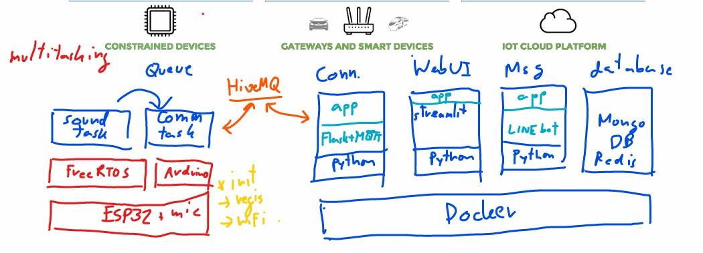
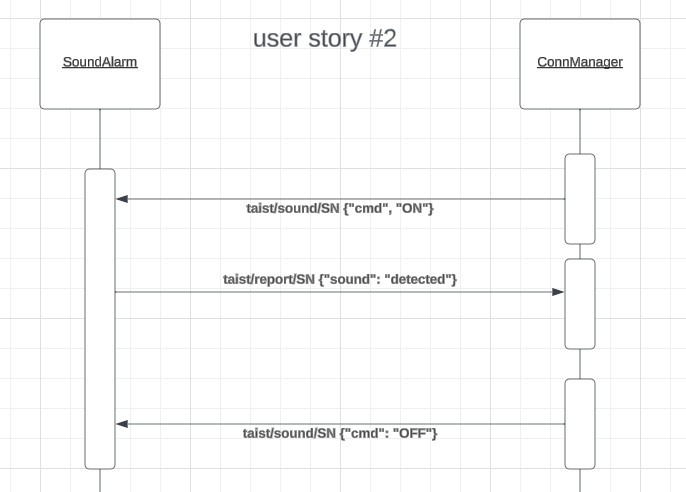
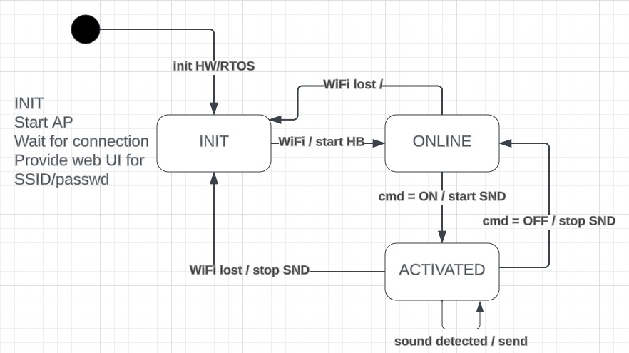

# ict720-project-2024
Repo to collect example of ICT720 course

## Member
Supachai Vorapojpisut

## Stakeholder
1.  home owner
2.  company staff

## user stories
1.  **US1**: as an owner, I want to register a device with my home WiFi network, so that I can use it.
    *   **acceptance criteria #1** I can fill SSID/password of my home WiFi
    *   **acceptance criteria #2** I can check my device is online
2.  **US2**: as an owner, I want to be notified when some sound is detected, so that I know there is some event in that place.
    *   **acceptance criteria #1** I can activate my device.
    *   **acceptance criteria #2** I get no notification when it is silent.
    *   **acceptance criteria #3** I get no notification when there is sound.
    *   **acceptance criteria #4** I can deactivate my device.
3.  **US3**: as a company staff, I want to monitor the status of devices, so that I know everything is ready.
    *   **acceptance criteria #1** I can see status of all devices (online/activated/alarm/offline).
    *   **acceptance criteria #2** I can see map of installed devices.
4.  **US4**: as a company staff, I want to contact a device owner, so that I can provide support to customers.
    *   **acceptance criteria #1** I can contact the device owner with alarm status.

## software models
1.  **Software architecture**
    
2.  **Device-server communication**
    
3.  **Device operation**
    

## examples
1.  **/taist_jan_18**
    *   template VS Code/Platform.io project with I2S sound driver.
    *   sample sound at 16 kHz, 160-sample window, average of absolute values. 
